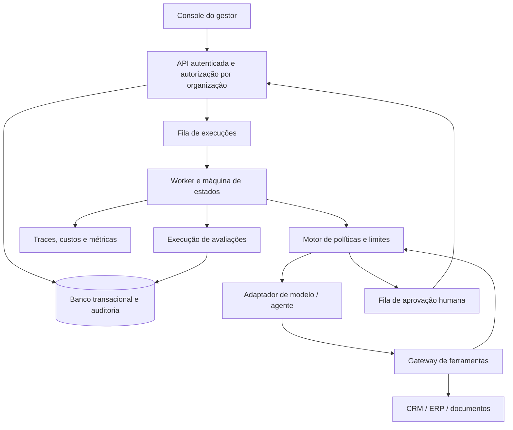

# Gestoria — plano da ferramenta

## Visão

Uma central de gestão da operação híbrida: **Gestor humano → supervisor IA → agentes → ferramentas → resultado do processo**. O produto deve responder: qual trabalho está sendo feito, quem responde por ele, que ações estão autorizadas, onde é necessária decisão humana, quanto custa e qual versão entrega melhor resultado.

O curso desenvolve a competência; a ferramenta mantém os artefatos e a rotina de gestão. O runtime executa o trabalho autorizado. Esses três componentes compartilham contratos, mas podem evoluir separadamente.

## Primeira versão entregue

Aplicativo web em português, executado localmente, com armazenamento no navegador:

- Visão geral com métricas derivadas dos registros e filtro por processo.
- Processos: cadastro, edição, objetivo, responsável, etapas, volume, baseline, meta e orçamento acumulado de laboratório.
- Força de trabalho: ficha de cargo, ferramentas planejadas, Skills, fontes, nível de autonomia, responsável, versão, pausa e retomada.
- Simulador: cenários normal, duvidoso e fora da política; custo fictício fixo e encaminhamento humano conforme nível e cenário.
- Decisões: entrega, motivo, aprovação/devolução e justificativa; aprovação de versão antiga ou agente pausado é bloqueada.
- Avaliações: esperado × produzido, classificação humana e vínculo com versão. Casos históricos ficam separados das métricas atuais.
- Promoção: um nível por vez, 100 casos da versão atual, meta do processo, zero erros críticos, nenhuma pendência e decisão humana. Mudança cria nova versão.
- LOOP-R: problema, hipótese, responsável, evidência e progressão sequencial proposta → teste → validação → promoção; etapas finais exigem evidência.
- Histórico local, exportação/importação JSON com validação, restauração confirmada e atualização entre abas.
- Downloads dos planos e templates.

**Não implementado:** execução real de agentes, conexão de ferramentas, coordenação multiagente, autenticação, permissões de usuário, armazenamento compartilhado, cobrança, recuperação semântica, memória operacional, upload de conhecimento, datasets de produção, monitoramento em tempo real, SLAs, notificações e cálculo completo de ROI. Nome/modelo/ferramentas/Skills na ficha são metadados; seu cadastro não cria capacidade de execução.

Regras no cliente são mecanismos de laboratório. O usuário pode editar o armazenamento e a cópia JSON; eles não representam uma fronteira de segurança. O histórico local é editável, limitado aos 300 registros mais recentes e não equivale a auditoria empresarial. Os valores iniciais, pessoas e empresas são fictícios. O nível 3 do pesquisador é um exemplo pré-carregado, não resultado de validação executada.

## Usuários e trabalhos

| Papel futuro | Trabalho principal | Decisão sob sua responsabilidade |
|---|---|---|
| Dono do processo | Definir meta, orçamento, resultado e risco | Aceitar piloto e responsabilizar-se pela operação |
| Gestor de IA | Desenhar cargos, supervisionar e avaliar | Propor versões e coordenar melhoria |
| Especialista da área | Curar exemplos, avaliar saídas e resolver exceções | Determinar se o trabalho está correto |
| Integrador | Implementar conectores e controles de execução | Garantir limites técnicos e confiabilidade |
| Revisor autorizado | Aprovar ações específicas | Autorizar o conteúdo exato dentro de seu escopo |
| Administrador | Gerir organizações, acesso e credenciais | Autorizar conexões e políticas globais |

## Fluxo principal do produto integrado

1. Cadastrar empresa, equipe e processo; documentar baseline e meta.
2. Criar cargo e versão com instruções, conhecimento, Skills e memória.
3. Conectar ferramentas em ambiente de teste; verificar escopos de leitura e escrita.
4. Definir política por ação, responsáveis, orçamento, tentativas, SLA e interrupção.
5. Criar conjunto de referência; comparar configurações e guardar evidências.
6. Executar piloto em nível 1 ou 2, incluindo casos normais e exceções.
7. Aprovar entregas com conteúdo fixado; acompanhar qualidade, espera e custo total.
8. Promover escopo limitado após avaliação humana; monitorar e reverter se necessário.
9. Abrir experimentos LOOP-R; validar candidato e registrar decisão de mudança.

## Modelo de dados de produção

| Entidade | Campos essenciais e relações |
|---|---|
| Organização | ID, política de dados, configurações; fronteira de isolamento |
| Usuário / vínculo | Organização, identidade, função, escopos de processo e aprovação |
| Processo | Dono, resultado, baseline, métricas, gatilho, fluxos, orçamento, SLA |
| Cargo / versão | Processo, missão, entradas, saídas, instruções, modelo, responsável, estado |
| Skill / versão | Contrato de entrada/saída, procedimento, dependências, testes e hash |
| Conhecimento / coleção | Fonte, proprietário, autorização de uso, versão, validade, retenção |
| Política de memória | Escopo, campos permitidos, retenção, correção, descarte |
| Ferramenta / conexão | Schema, operações, escopos, referência ao segredo, ambiente e saúde |
| Política de ação | Agente/versão, ferramenta/operação, condições, limite, aprovação e prazo |
| Workflow / versão | Nós, dependências, contratos, condições de parada e supervisor |
| Execução / etapa | Caso, snapshot de versões, estado, trace, tentativas, custo e saída |
| Aprovação | Execução, ação proposta, hash do conteúdo, aprovador, justificativa, expiração |
| Exceção / incidente | Severidade, motivo, contexto, responsável, SLA e resolução |
| Dataset / caso | Versão, entrada, esperado, categoria de risco, origem, partição treino/teste |
| Avaliação | Dataset e pacote de versão, observado, rubrica, avaliador e resultado |
| Experimento | Problema, hipótese, baseline, candidato, evidências e decisão |
| Promoção / reversão | Versão anterior/nova, aprovador, escopo, plano de rollout e monitoramento |
| Evento de auditoria | Organização, identidade, ação, objeto, antes/depois redigidos e horário |

Todos os objetos de produção pertencem à organização. Relações devem preservar essa fronteira. Saídas e documentos não podem conceder permissões nem substituir a política do servidor.

## Arquitetura proposta para a etapa integrada

O diagrama é conceitual. A escolha de bibliotecas, fornecedores, provedor de identidade e implantação depende da empresa piloto. Uma base relacional, fila com workers, arquivos privados e adaptadores desacoplados de modelos atende à separação proposta. O navegador nunca guarda segredos nem chama uma operação privilegiada diretamente.

**Máquina de estados:** criada → validando → executando → aguardando aprovação ou exceção → retomada → concluída. Estados terminais adicionais: falhou, cancelada, expirada. Aguardar humano libera o worker; retomada usa o snapshot autorizado. Cada transição valida o estado atual atomicamente.

**Execução confiável:** idempotência por efeito externo; deduplicação; timeout por ferramenta e processo; tentativas limitadas com backoff; compensação quando houver reversão possível; orçamento reservado antes do trabalho; custo final reconciliado; bloqueio de novas ações ao pausar. Cancelamento não desfaz efeitos já realizados.

**Controle de autonomia:** prompt explica a política; servidor a aplica. Ferramentas sem autorização são negadas. Limites financeiros, campos editáveis, destinatários e operações são verificados antes do efeito. Supervisores usam as mesmas fronteiras. Ações críticas seguem a matriz humana independentemente do nível geral.

**Aprovação:** proposta imutável com diff legível, destino, dados relevantes, hash, versão, aprovador autorizado e expiração. Aprovação inválida, repetida ou de versão antiga não executa. A alteração do conteúdo exige nova aprovação.

**Observabilidade:** traces por caso e etapa, custos observados e estimados distintos, token/tool usage quando disponível, latência, tentativas, falhas e espera humana. Não registrar segredos ou dados pessoais desnecessários. Retenção e acesso aos traces são definidos pela política da empresa.

## APIs conceituais a implementar

São contratos propostos, não endpoints disponíveis no MVP.

| Operação | Efeito |
|---|---|
| Criar/alterar processo | Salvar objetivo, dono e política versionada |
| Publicar versão de cargo | Produzir pacote imutável de configuração |
| Criar execução | Validar entrada, reservar orçamento e enfileirar com idempotência |
| Solicitar decisão | Congelar ação e evidências para aprovador autorizado |
| Decidir aprovação | Validar identidade, escopo, prazo, hash e estado antes de retomar |
| Avaliar candidato | Executar dataset versionado e guardar saídas e notas |
| Promover/reverter versão | Validar evidência e autorização; aplicar rollout controlado |
| Pausar processo | Bloquear novos efeitos e sinalizar trabalho já em andamento |

## Roadmap por evidência de saída

| Fase | Entrega | Critério para avançar |
|---|---|---|
| 0 — Método e laboratório | MVP local + plano pedagógico + templates | Gestor consegue desenhar um processo e completar revisão, avaliação e proposta de melhoria |
| 1 — Piloto integrado | Uma organização, autenticação, banco, um modelo, CRM leitura, preparação com revisão humana | Casos reais autorizados, custos observados, isolamento e revisão funcionando |
| 2 — Operação controlada | Escrita restrita, fila durável, idempotência, políticas no servidor, alertas e reversão | Duplicação evitada; falhas recuperáveis; aprovação inseparável do conteúdo; nenhum efeito fora do escopo |
| 3 — Equipe digital | Workflow, supervisor limitado, contratos e budgets por etapa | Multiagente só permanece se melhorar resultado/custo frente à solução simples |
| 4 — Portfólio empresarial | Vários processos, organizações, indicadores e governança de versões | Isolamento testado, operação sustentável e melhoria demonstrada no piloto |

Não há cronograma fechado: depende dos conectores, requisitos de dados, equipe e acesso ao processo. Antes de estimar prazo, escolher a empresa piloto e integrar uma leitura ponta a ponta.

## Critérios de sucesso e verificação

- O gestor cadastra um processo e identifica o responsável por cada entrega.
- Agentes e execuções preservam versão e vínculo com o processo.
- Um caso normal e um caso crítico seguem rotas diferentes conforme a política.
- Nenhuma escrita real ocorre sem autorização aplicável e válida.
- Pausa, duplicação, timeout, aprovação tardia e versão alterada têm comportamento verificável.
- Métricas têm denominador, período e origem; intervenção humana nunca é contada como autonomia.
- Uma alteração ruim é detectada na avaliação e pode ser revertida.
- O custo completo do piloto é comparado ao baseline, sem confundir capacidade liberada com redução de despesa.

## Próximo recorte recomendado

Usar qualificação comercial em nível 2: importar leads autorizados, consultar fontes e CRM em leitura, preparar classificação e justificativa, exigir aprovação humana e guardar resultado. Somente depois considerar escrita no CRM. Não começar por envio autônomo de propostas ou coordenação de dezenas de agentes.
